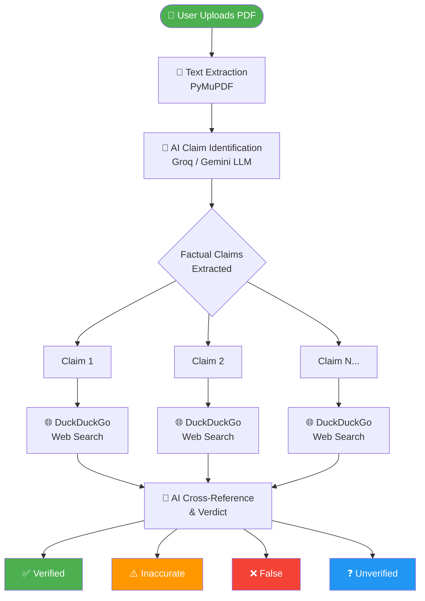
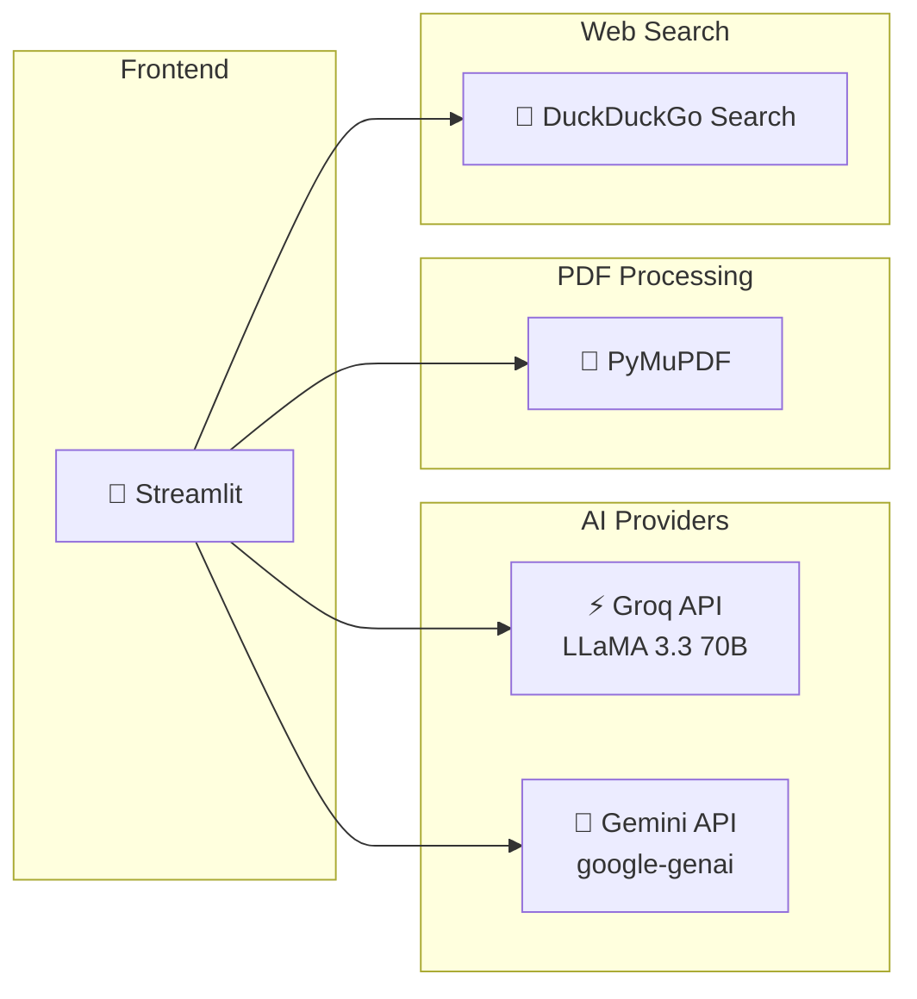

<div align="center">

# 🕵️ Fact-Check Agent

### *The AI-Powered Truth Layer for Any Document*

> ### 🚀 [**▶ Try the Live App → factcheck-agentz.streamlit.app**](https://factcheck-agentz.streamlit.app/)

[](https://factcheck-agentz.streamlit.app/)
[](https://github.com/Harsh-karn/Fact_Check-Agent)
[](https://python.org)
[](https://groq.com)
[](https://aistudio.google.com)

> Upload any PDF. The agent reads it, searches the live web, and tells you what's **true**, what's **outdated**, and what's outright **false** — in seconds.

---

</div>

## 🎯 What Problem Does This Solve?

Marketing decks, research reports, and whitepapers are full of statistics that can be **outdated, hallucinated, or fabricated**. Manual fact-checking is slow and error-prone. The Fact-Check Agent acts as an automated **"Truth Layer"** that reads documents and cross-references every claim against live web data.

---

## ⚙️ How It Works



---

## ✨ Features

| Feature | Description |
|--------|-------------|
| 📄 **PDF Upload** | Upload any PDF and extract text automatically |
| 🤖 **Dual AI Provider** | Choose between **Groq (LLaMA 3.3 70B)** or **Google Gemini** |
| 🌐 **Live Web Search** | Uses DuckDuckGo to find real-time evidence for each claim |
| ✅ **Verdict Engine** | Each claim is judged: Verified, Inaccurate, False, or Unverified |
| 📊 **Summary Dashboard** | Instant metrics breakdown at a glance |
| ⚡ **Groq Free Tier** | No daily quota issues — blazing fast inference |
| 🔄 **Auto Retry** | Handles rate limits gracefully with exponential backoff |

---

## 🏗️ Tech Stack



---

## 🚀 Quick Start

### Option 1 — Use the Live App
👉 Visit **[factcheck-agentz.streamlit.app](https://factcheck-agentz.streamlit.app/)**
- Get a free Groq API key from [console.groq.com/keys](https://console.groq.com/keys)
- Upload your PDF → Click **Analyze Document**

### Option 2 — Run Locally

```bash
# 1. Clone the repo
git clone https://github.com/Harsh-karn/Fact_Check-Agent.git
cd Fact_Check-Agent

# 2. Install dependencies
pip install -r requirements.txt

# 3. Run the app
python -m streamlit run app.py
```

Open your browser at `http://localhost:8501`

---

## 🔑 API Keys

| Provider | Where to Get | Cost |
|----------|-------------|------|
| **Groq** | [console.groq.com/keys](https://console.groq.com/keys) | ✅ Free tier — very generous |
| **Gemini** | [aistudio.google.com/app/apikey](https://aistudio.google.com/app/apikey) | ✅ Free tier available |

> 💡 **Recommendation:** Use **Groq** for testing — instant sign-up, no billing required, and no daily quota exhaustion.

---

## 📊 Verdict System

```
┌─────────────────────────────────────────────────────────────┐
│                    VERDICT CATEGORIES                        │
├──────────────┬───────────────────────────────────────────────┤
│  ✅ Verified  │ Web evidence confirms the claim is accurate   │
│  ⚠️ Inaccurate│ Partially true but with wrong/outdated data  │
│  ❌ False     │ Directly contradicts available evidence       │
│  ❓ Unverified│ Not enough data to confirm or deny           │
└──────────────┴───────────────────────────────────────────────┘
```

---

## 🧪 Testing with a "Trap Document"

The app is designed to catch intentional lies. For example, a document claiming:

> *"Apple's revenue in 2023 was $50 billion"* → ❌ **FALSE** — Apple's actual revenue was ~$383 billion

> *"The Eiffel Tower is 500 meters tall"* → ❌ **FALSE** — It is 330 meters tall

> *"Python was created in 1991"* → ✅ **VERIFIED** — Confirmed by multiple sources

---

## 📁 Project Structure

```
Fact_Check-Agent/
│
├── app.py              # Main Streamlit application
├── requirements.txt    # Python dependencies
├── README.md           # This file
└── .gitignore          # Git ignore rules
```

---

## 🌐 Deployment

This app is deployed on **Streamlit Community Cloud**:

1. Push code to GitHub
2. Connect repo at [share.streamlit.io](https://share.streamlit.io)
3. Set `app.py` as the main file
4. Click **Deploy!**

---

<div align="center">

Built with ❤️ using Streamlit, Groq, and DuckDuckGo Search

⭐ **Star this repo if you found it useful!** ⭐

</div>
